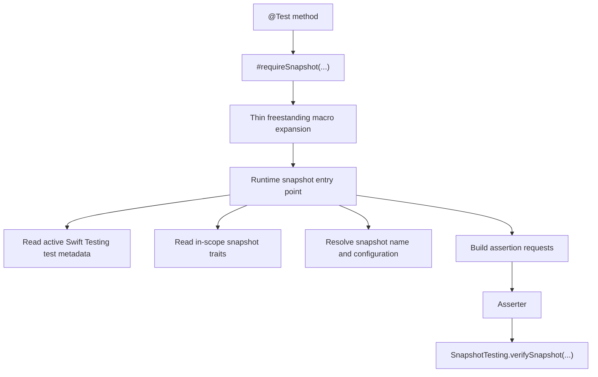

# Native Swift Testing Snapshot API Design

| Field | Value |
| --- | --- |
| Status | Draft for audit |
| Date | 2026-05-14 |
| Branch | `snapshot-helpers` |
| Audience | Maintainers and reviewers of this package |
| Primary goal | Replace the macro-generated snapshot test surface with a first-class Swift Testing extension |

## Summary

- Move the public API from `@SnapshotSuite` / `@SnapshotTest` onto native Swift Testing `@Suite` / `@Test`.
- Make snapshot assertions feel like Swift Testing by introducing a freestanding `#requireSnapshot(...)` assertion macro backed by runtime functions.
- Keep snapshot-specific behavior in ordinary traits such as `.theme(...)`, `.sizes(...)`, `.padding(...)`, `.backgroundColor(...)`, `.strategy(...)`, `.record(...)`, and `.diffTool(...)`.
- Preserve configuration naming and tuple-unpacking ergonomics through [`SnapshotConfiguration`](../../../Sources/SnapshotTestingMacros/SnapshotConfiguration/SnapshotConfiguration.swift) and configuration-aware `#requireSnapshot(...)` overloads.
- Avoid the architectural pitfall exposed by Xcode 26.4.1 and 26.5 by removing generated child `@Suite` / `@Test` declarations from the supported path.

## Problem statement

The current public design depends on attached macros that generate nested Swift Testing suites and tests. That path is built around [`SnapshotSuite`](../../../Sources/SnapshotsMacros/SnapshotSuite/SnapshotSuite.swift), [`SnapshotTest`](../../../Sources/SnapshotsMacros/SnapshotTest/SnapshotTest.swift), and [`SnapshotTestMacroDefinition`](../../../Sources/SnapshotTestingMacros/MacroDefinitions/SnapshotTestMacroDefinition.swift).

That design worked when the toolchain accepted the generated child suite shape, but it is now a brittle dependency on Swift Testing's internal expansion strategy rather than a stable extension point.

### Evidence

| Toolchain | Result | Notes |
| --- | --- | --- |
| Xcode 26.3 | Passes | Consumer snapshot targets still compile |
| Xcode 26.4.1 | Fails | Generated child `@Suite` expansion produces errors such as `properties with attribute @used must be static` and instance-member use inside property initializers |
| Xcode 26.5 | Fails | Same failure family in the generated child suite path |

The failure is not in the runtime snapshot assertion path. It is in the generated Swift Testing declaration path.

## Design decision

This package will become a first-class Swift Testing extension rather than a test-definition macro package.

That means:

1. Test declaration stays native to Swift Testing.
2. Snapshot behavior is expressed as traits plus an assertion macro.
3. Runtime snapshot logic remains reusable and testable without relying on child declaration macros.
4. Future features must compose with Swift Testing's supported extension points rather than synthesize new tests or suites under the user's feet.

## Goals

- Keep the public test shape obvious and idiomatic for Swift Testing users.
- Remove the requirement for generated child `@Suite` / `@Test` declarations.
- Preserve current snapshot defaults and on-disk behavior where the logical inputs are equivalent.
- Keep the zero-friction call-site for synchronous tests.
- Support async and throwing producers without making `try` / `await` mandatory for ordinary cases.
- Preserve named configurations and tuple-based configuration ergonomics.
- Allow multiple snapshots inside one native `@Test`.
- Keep existing runtime pieces such as [`Asserter`](../../../Sources/SnapshotTestingMacros/Assertion/Asserter.swift), [`AssertionRequestGenerator`](../../../Sources/SnapshotTestingMacros/Assertion/RequestGenerator/AssertionRequestGenerator.swift), and [`SnapshotNameNormalizer`](../../../Sources/SnapshotTestingMacros/Assertion/RequestGenerator/SnapshotNameNormalizer.swift) as the foundation where possible.

## Non-goals

- Keep `@SnapshotSuite` and `@SnapshotTest` as the primary documented API.
- Introduce a new custom test declaration DSL parallel to Swift Testing.
- Require a dedicated activation trait such as `.snapshots`.
- Recreate every legacy macro convenience if the equivalent native Swift Testing shape is already better.
- Depend on attached child macros going forward.

## Design principles

1. **Swift Testing first.** Test names, parameterization, tags, conditions, time limits, and suite structure should use Swift Testing directly.
2. **Assertion macro, not declaration macro.** The only public macro in the new happy path is `#requireSnapshot(...)`, which behaves like a thin assertion spell over runtime code.
3. **Traits configure behavior.** Snapshot traits set scoped configuration; they do not define or synthesize tests.
4. **No hidden activation ceremony.** If a test uses `#requireSnapshot(...)`, snapshot behavior is active. If snapshot traits are present, the assertion reads them automatically.
5. **Runtime owns orchestration.** Naming, counters, configuration expansion, request generation, and assertion routing are runtime concerns, not declaration-generation concerns.
6. **Stable extension points only.** Going forward, new features should land as traits, assertion options, or runtime capabilities, not child declaration synthesis.

## Proposed public API

### Basic usage

```swift
struct ProfileCardSnapshots {
  @Test
  func profileCard() {
    #requireSnapshot(ProfileCard())
  }
}
```

### Suite-level snapshot traits

```swift
@Suite(.theme(.all), .sizes(.minimum))
struct ProfileCardSnapshots {
  @Test
  func profileCard() {
    #requireSnapshot(ProfileCard())
  }
}
```

### Test-level overrides

```swift
@Suite(.theme(.light), .sizes(.minimum))
struct ProfileCardSnapshots {
  @Test(.tags(.smoke))
  func defaultCard() {
    #requireSnapshot(ProfileCard())
  }

  @Test(.theme(.dark), .padding(16))
  @MainActor
  func paddedDarkCard() {
    #requireSnapshot(ProfileCard(), named: "padded-dark")
  }
}
```

### Inline construction

```swift
@Test
func loadedProfileCard() {
  #requireSnapshot(named: "loaded") {
    ProfileCard(state: .loaded)
  }
}
```

### Async and throwing producers

```swift
@Test
func remoteProfileCard() async throws {
  try await #requireSnapshot(named: "remote-loaded") {
    let model = try await client.loadProfile()
    return ProfileCard(model: model)
  }
}
```

### Multiple snapshots inside one test

```swift
@Test
func profileCardStates() {
  #requireSnapshot(ProfileCard(state: .loading), named: "loading")
  #requireSnapshot(ProfileCard(state: .loaded), named: "loaded")
  #requireSnapshot(ProfileCard(state: .error), named: "error")
}
```

## Public API inventory

| Symbol | Role |
| --- | --- |
| `#requireSnapshot(_ value)` | Primary direct-value snapshot assertion |
| `#requireSnapshot(_ value, named: String)` | Direct-value assertion with explicit artifact name |
| `#requireSnapshot(named: String? = nil) { ... }` | Closure-based assertion for inline construction or setup |
| `#requireSnapshot(_ configuration, named: String? = nil) { ... }` | Named configuration assertion using [`SnapshotConfiguration`](../../../Sources/SnapshotTestingMacros/SnapshotConfiguration/SnapshotConfiguration.swift) |
| `#requireSnapshot(configuration: value, named: String? = nil) { ... }` | Native argument fallback when callers do not need explicit [`SnapshotConfiguration`](../../../Sources/SnapshotTestingMacros/SnapshotConfiguration/SnapshotConfiguration.swift) values |
| `.theme(...)` | Snapshot trait controlling themes |
| `.sizes(...)` | Snapshot trait controlling render sizes |
| `.padding(...)` | Snapshot trait controlling extra padding |
| `.backgroundColor(...)` | Snapshot trait controlling background color |
| `.strategy(...)` | Snapshot trait controlling snapshot strategy |
| `.record(...)` | Snapshot trait controlling recording mode |
| `.diffTool(...)` | Snapshot trait controlling diff tool integration |

## Assertion semantics

- `#requireSnapshot(...)` returns `Void`.
- Snapshot mismatches record Swift Testing issues rather than throwing.
- `try` is required only when the supplied producer throws.
- `await` is required only when the supplied producer is async.
- The direct-value form is the preferred API.
- The closure form exists for inline setup and configuration mapping.
- Snapshot rendering and decoration are internally main-actor-safe; users should not need blanket `@MainActor` simply to adopt the API.
- `#requireSnapshot(...)` is only supported inside Swift Testing tests. Using it outside an active test is an unsupported misuse and must fail fast with a clear developer-facing message.

## First-class Swift Testing integration

This design should read like Swift Testing with snapshot support, not like a separate framework pretending to be Swift Testing.

### Rules

1. **Use Swift Testing for test declaration**
   - `@Test`
   - `@Suite`
   - `@Test(arguments:)`
   - `@Test("Display Name")`
   - native Swift Testing traits such as `.tags(...)`, `.bug(...)`, `.enabled(...)`, `.disabled(...)`, and `.timeLimit(...)`
2. **Use snapshot traits only for snapshot-specific concerns**
   - themes
   - sizes
   - padding
   - background color
   - strategy
   - record mode
   - diff tool
3. **Use `#requireSnapshot(...)` for snapshot assertions**
   - not for test definition
   - not for suite definition
   - not as a separate parallel test framework
4. **Prefer native Swift Testing naming**
   - suite names come from the suite type or `@Suite("...")`
   - test names come from the test function or `@Test("...")`
   - snapshot names are derived from the active Swift Testing test plus optional `named:` overrides

### What this means going forward

- If Swift Testing adds better traits, naming, attachments, or parameterization features, this package should adopt them directly rather than wrapping them in snapshot-specific mirrors.
- New snapshot features should map to either:
  1. a new snapshot trait, or
  2. a new `#requireSnapshot(...)` option or overload.
- New features should **not** create new child declaration macros.

## Runtime and macro architecture



### Architectural rules

- The public happy path may use a freestanding expression macro.
- The public happy path must not use attached peer/member/accessor macros to generate child tests or suites.
- The freestanding macro should do the minimum useful work:
  - capture source location
  - normalize syntax into a stable runtime call shape
  - preserve the direct-value and closure ergonomics
- All behavior with long-term maintenance cost should live in runtime code, not in generated declaration shape.

### Runtime model

- The runtime entry point gathers:
  - active test metadata from Swift Testing
  - source location from the macro expansion
  - explicit `named:` override if provided
  - active snapshot traits from scoped task-local values
  - optional configuration name/value context
- The runtime then constructs assertion requests and dispatches through [`Asserter`](../../../Sources/SnapshotTestingMacros/Assertion/Asserter.swift).
- [`AssertionRequestGenerator`](../../../Sources/SnapshotTestingMacros/Assertion/RequestGenerator/AssertionRequestGenerator.swift) remains the authority for snapshot directory layout, normalized naming, and request fan-out.
- Snapshot-specific counters and call indexing become runtime state owned by the assertion path rather than by a user-visible activation trait.

## Trait model

Snapshot traits become ordinary Swift Testing traits first and snapshot concepts second.

### Trait behavior

- Snapshot traits may be placed on a suite or individual tests.
- Snapshot traits are inert unless a test actually performs a snapshot assertion.
- Snapshot traits scope configuration around the active test using Swift Testing's supported scoping mechanisms.
- Public API should not require callers to think in terms of [`SnapshotTestTrait`](../../../Sources/SnapshotTestingMacros/Traits/_Types/SnapshotTrait/SnapshotTestTrait.swift), [`SnapshotSuiteTrait`](../../../Sources/SnapshotTestingMacros/Traits/_Types/SnapshotTrait/SnapshotSuiteTrait.swift), or [`SnapshotTestScoping`](../../../Sources/SnapshotTestingMacros/Traits/_Types/TestScoping/SnapshotTestScoping.swift). Those concepts may remain internally if useful during migration, but they are not part of the long-term public story.

### Defaults

Whenever `#requireSnapshot(...)` runs without an overriding snapshot trait, the runtime applies these defaults:

| Setting | Default |
| --- | --- |
| Theme | `.all` |
| Size | `.minimum` |
| Strategy | `.image` |
| Record mode | `.missing` |
| Diff tool | `.default` |

### Precedence

| Order | Winner |
| --- | --- |
| defaults < suite traits < test traits | later scope wins |
| same declaration, duplicate snapshot traits of the same kind | later trait wins |

## Configuration model

### Primary configuration path

Keep [`SnapshotConfiguration`](../../../Sources/SnapshotTestingMacros/SnapshotConfiguration/SnapshotConfiguration.swift) as the named configuration wrapper for snapshot-oriented parameterized tests.

```swift
@Test(arguments: [
  SnapshotConfiguration(name: "logged-out", value: UserState.loggedOut),
  SnapshotConfiguration(name: "logged-in", value: UserState.loggedIn),
])
func profileCard(configuration: SnapshotConfiguration<UserState>) {
  #requireSnapshot(configuration) { state in
    ProfileCard(state: state)
  }
}
```

### Tuple configuration ergonomics

The new API preserves the current "unpack the configuration into the closure" feel.

```swift
@Test(arguments: [
  SnapshotConfiguration(name: "compact-empty", value: (Layout.compact, UserState.loggedOut)),
  SnapshotConfiguration(name: "regular-loaded", value: (Layout.regular, UserState.loggedIn)),
])
func profileCard(configuration: SnapshotConfiguration<(Layout, UserState)>) {
  #requireSnapshot(configuration) { layout, state in
    ProfileCard(layout: layout, state: state)
  }
}
```

Tuple-unpacking overloads will be provided for tuple arities 2 through 6. Larger tuple values may still be snapshotted, but callers destructure them manually inside the closure.

### Native argument fallback

When explicit configuration names are not needed, the native Swift Testing argument value can be passed directly.

```swift
@Test(arguments: UserState.allCases)
func profileCard(state: UserState) {
  #requireSnapshot(configuration: state) { state in
    ProfileCard(state: state)
  }
}
```

### Configuration naming rules

- `#requireSnapshot(configuration)` uses `configuration.name` when present.
- If `configuration.name` is `nil`, the runtime derives a snapshot-safe name from the configuration value using the same normalization strategy as [`SnapshotNameNormalizer`](../../../Sources/SnapshotTestingMacros/Assertion/RequestGenerator/SnapshotNameNormalizer.swift).
- `#requireSnapshot(configuration: value)` always derives a name from the value unless an explicit `named:` override is provided.
- [`SnapshotConfigurationParser`](../../../Sources/SnapshotTestingMacros/SnapshotConfiguration/SnapshotConfigurationParser.swift) becomes compatibility support rather than the main public surface.

## Naming and filesystem behavior

### Naming sources

| Input | Effect |
| --- | --- |
| Native Swift Testing test name | Primary logical snapshot name |
| `@Test("...")` | Replaces the default test-derived logical name |
| `named:` | Overrides the artifact name for a specific assertion |
| [`SnapshotConfiguration`](../../../Sources/SnapshotTestingMacros/SnapshotConfiguration/SnapshotConfiguration.swift) name | Prefixes or scopes the artifact name for configured cases |
| Source location | Used internally to keep multi-assertion naming deterministic |

### Filesystem goals

- Preserve the existing snapshot root and directory derivation logic from [`AssertionRequestGenerator`](../../../Sources/SnapshotTestingMacros/Assertion/RequestGenerator/AssertionRequestGenerator.swift) wherever the same logical inputs are used.
- Preserve current normalization behavior via [`SnapshotNameNormalizer`](../../../Sources/SnapshotTestingMacros/Assertion/RequestGenerator/SnapshotNameNormalizer.swift).
- Support multiple snapshot assertions in one test without name collisions.
- Keep retries and repetitions stable so repeated runs do not invent fresh reference artifacts.

### Multi-assertion behavior

- Multiple unnamed `#requireSnapshot(...)` calls in one test receive deterministic internal suffixing.
- Multiple named `#requireSnapshot(...)` calls keep the explicit name and receive deterministic suffixing only on collision.
- The runtime, not a visible activation trait, owns per-test numbering and reset behavior.

## Migration contract

| Old shape | New shape |
| --- | --- |
| `@SnapshotSuite` | Plain suite type, or `@Suite(...)` when suite-level traits or naming are needed |
| `@SnapshotTest` | `@Test` + `#requireSnapshot(...)` |
| `@SnapshotTest("Name")` | `@Test("Name")` + `#requireSnapshot(...)` |
| `configurations:` | `@Test(arguments:)` + `#requireSnapshot(configuration) { ... }` |
| `configurationValues:` | `@Test(arguments:)` + `#requireSnapshot(configuration: value) { ... }` |
| snapshot-specific wrappers for native Swift Testing traits | native Swift Testing traits directly |

This is a deliberate pivot to the new native API. Legacy macros may continue to exist temporarily as compatibility surface, but they are not the documented main path.

## Compatibility and pitfalls to avoid

### Pitfalls already discovered

1. **Child declaration macros are brittle**
   - Generating nested Swift Testing suites and tests ties this package to Swift Testing's internal expansion details.
   - Xcode 26.4.1 and 26.5 broke this path.
2. **Snapshot activation should not require extra ceremony**
   - A dedicated `.snapshots` trait adds cognitive overhead while also carrying runtime responsibilities that can be handled internally.
3. **Parameterization should stay native**
   - Snapshot-specific parameter DSLs are harder to evolve than Swift Testing's own `@Test(arguments:)`.

### Guardrails going forward

- Do not add new attached macros to the main API surface.
- Do not generate child tests, child suites, or child helper declaration containers for end-user use cases.
- Keep snapshot defaults and naming behavior in runtime code, not declaration expansion.
- Prefer Swift Testing-native features whenever there is a direct equivalent.
- Treat new compiler regressions in macro-generated declarations as a signal to remove declarative cleverness rather than add more of it.

## Validation plan

### Code changes

- Rewrite the integration fixtures under [`Tests/SnapshotsIntegrationTests`](../../../Tests/SnapshotsIntegrationTests) to the new native API shape.
- Keep or adapt unit coverage around naming, request generation, and runtime assertion behavior.
- Add focused tests for configuration-aware `#requireSnapshot(...)` overloads, including tuple unpacking and derived names.

### Toolchain validation

- Verify a minimal consumer fixture builds on:
  - Xcode 26.3
  - Xcode 26.4.1
  - Xcode 26.5
- Verify the rewritten native fixtures no longer depend on generated child suites or child tests.

### Documentation follow-up

- Add [`MIGRATION.md`](../../../MIGRATION.md) at the repository root after implementation lands.
- `MIGRATION.md` should include concrete before/after examples for:
  - `@SnapshotSuite` to native suite migration
  - `@SnapshotTest` to `@Test` + `#requireSnapshot(...)`
  - `configurations:` to `@Test(arguments:)` + configuration-aware `#requireSnapshot(...)`
  - `configurationValues:` to native arguments and the backup configuration overload

## Audit focus areas for subagents

### 1. API design audit

- Is the public surface too broad or too clever?
- Are the overloads easy to discover?
- Is there a simpler direct-value / closure / configuration shape that reads better at the call-site?

### 2. First-class Swift Testing audit

- Does the package now feel like a natural extension of Swift Testing rather than a parallel framework?
- Are we using native Swift Testing features directly wherever possible?
- Are any snapshot-specific wrappers still unnecessary?

### 3. Long-term architecture and pitfall audit

- Does the design clearly avoid the class of failures exposed by child declaration macros?
- Are there hidden runtime-state risks introduced by removing `.snapshots`?
- Are there future extension points that would tempt us back into declaration synthesis?

### 4. General holistic audit

- Is the design coherent across API, runtime, naming, migration, and validation?
- Are there missing edge cases for multi-assertion tests, async producers, or parameterized tests?
- Is anything under-specified enough to create churn during implementation?
